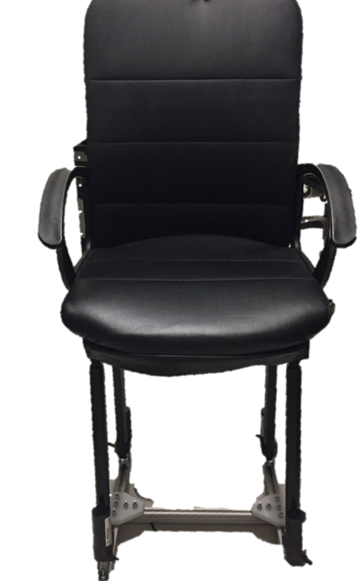

# Rocking is the new Running

Refactoring the age-old technique into a workplace intervention through a robotic chair that automatically intervenes for users’ comfort.

<p align="center">
  
</p>

## Motivation

Sitting is the new smoking. First enunciated by Mayo clinic’s Dr. Levine, and subsequently popularized by dozens of journalistic posts on the topic, this phrase has caught public imagination because of the sheer ubiquity of act of sitting. An average adults spends 50-70% of their day sitting. This can lead to diabetes, cardiovascular diseases, and even premature death, and any amount of exercise done duirng the rest of the day doesn't really make up for the harnful effects of extensive sitting. Since reducing this sitting time is not practical, we attempt to make the time we spend sitting less harmful.

## Stimulus

Think cradling babies to sleep – experience supports the relaxing effect of rocking. Recent work has showed that the sensory stimulation induced by the swinging motion reinforces endogenous sleep rhythms and leads to faster onset of sleep. Active rocking has been shown to have positive psychosocial impact on dementia patients and infants, with calming effects on anxiety. This led to the hypothesis that rocking during tasks should have a calming effect on workplace anxiety and stress. 

## Goal

In order to bring the benefits of rocking into office settings, we investigate the effects of rocking on stress levels, focus, and task performance. The goal is to develop an intervention that has a calming effect on stress, with a neutral/positive effect on focus and task performance.

## Experiment

Participants are divided into a control group, which receives no intervention, and an experiment group, which receives a static 1/6 Hz sideways rocking as a stimulus. Participants perform a series of tasks including the Stroop test, the Sing-a-Song stress test, and modifications of the Trier Social Stress Test. The outputs we measure include • STAI-Y-1 scores to measure self-reported state anxiety before and after the stressor • Galvanic Skin Resistance (GSR), as a metric of arousal and stress • Heart Rate, as a measure of stress • Response Time, as a measure of focus, and • Accuracy, as a measure of task performance.

<p align="center">
  
</p>

## Wiki

- The Arduino IDE is needed to run this code.

- The main file for the latest version (with Cytron motor drivers) is ```pilot.ino``` in ```root/pilot```. The ```loop()``` function contains several modes:
  - ```takeSerialInput2``` takes in ```mode + actuator_num``` as serial input
  - ```controlledRockChair``` follows a pre-defined rocking pattern
  
- The main file for a version with L298N motor drivers is ```demo.ino``` in ```root/demo```. The ```loop()``` function contains several modes:
  - ```takeSerialInput``` takes in ```mode + actuator_num``` as serial input
  - ```rockChair``` follows a pre-defined rocking pattern
  
- ```single_actuator``` and ```multiple_actuators``` have modular versions of motor driver code for single and multiple actuator systems, respectively.
  
- Before using any program, ensure that the pin numbers on your Arduino board match those in the code.

# Stressor

Code for Math and Sing-a-Song stressors. The tests are in the form of a webpage.

The math stressor runs for 300 seconds. After the time elapses, press <kbd>Shift</kbd> to automatically restart, and press <kbd>Ctrl</kbd> to switch to the Sing-a-Song test.
